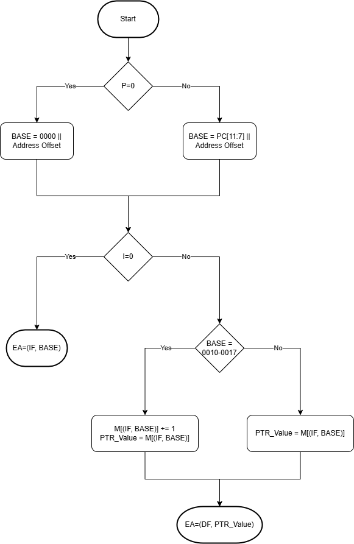

# Effective Address (EA) Generation Algorithm

## Scope

Applies only to Memory Reference Instructions (MRI).  

See:  
- [Encoding model](./00-encoding-model.md)
- [Addressing model](./04-addressing-models.md)

---

## Notation

All final effective addresses are expressed as:

```
FXXXX
```

Where:

- F = field  
- XXXX = 12-bit address  

---

## Overview

The EA is formed by:

1. Selecting a base address using the page bit (P)
2. Resolving direct or indirect addressing (mutually exclusive)
3. Applying field selection (IF or DF)




---

## Inputs

- IR bits: I, P, offset[0:6]  
- PC (12-bit)  
- IF (Instruction Field)  
- DF (Data Field)  
- Memory M[]  

---

## Step 1: Base Address Formation (IF domain)

The base address is always formed in the IF domain, regardless of addressing mode.

If P = 0:

```
BASE = 0000 || offset
```

If P = 1:

```
BASE = PC[11:7] || offset
```

---

## Step 2A: Direct Addressing Path (I = 0)

Direct addressing does not involve indirection.

```
EA_field = IF
EA_addr  = BASE

EA = (EA_field, EA_addr)
STOP
```

Properties:

- Uses IF for both base formation and final access  
- No interaction with DF  

---

## Step 2B: Indirect Addressing Path (I = 1)

Indirect addressing resolves a pointer stored in memory.

### Step 2B.1: Pointer Location (IF domain)

The pointer location is defined by BASE in the IF domain.

---

### Step 2B.2: Auto-Index Handling

If BASE is in the auto-index range:

```
0010–0017 (octal)
```

Then:

```
M[(IF, BASE)] = M[(IF, BASE)] + 1
PTR_value     = M[(IF, BASE)]
```

Else:

```
PTR_value = M[(IF, BASE)]
```

---

### Step 2B.3: Final EA Formation (DF domain)

```
EA_field = DF
EA_addr  = PTR_value

EA = (EA_field, EA_addr)
STOP
```

---

## Invariants

- BASE is always formed using IF  
- Direct (I = 0) uses IF for final memory access  
- Indirect (I = 1):
  - Pointer location is (IF, BASE)  
  - Final EA is (DF, PTR_value)  
- Auto-index:
  - Applies only when I = 1  
  - Occurs before pointer use  
  - Operates in IF domain  
- Direct and indirect are mutually exclusive execution paths  

---

## Notes

- Pointer location is always addressed in IF  
- Pointer value is interpreted as an address in DF  
- Indirect addressing enables cross-field access via DF  

