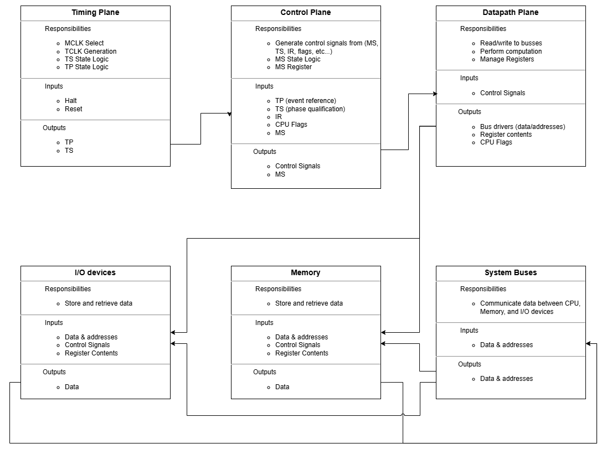
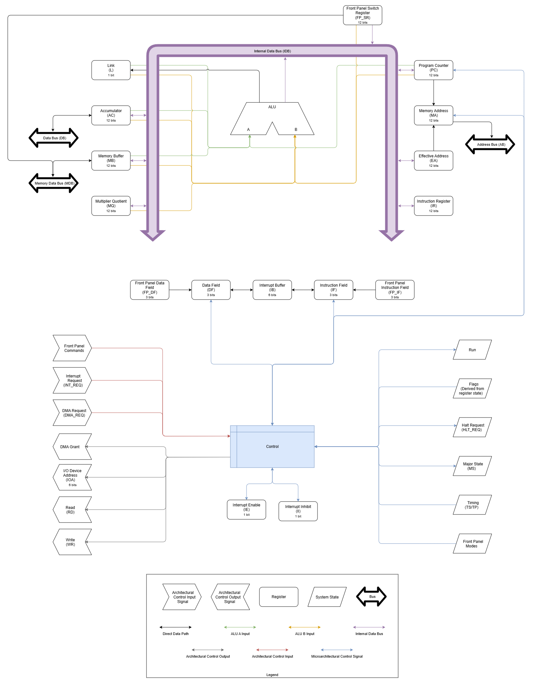

# Microarchitecture

Reference Diagram:

## 1. Purpose

Defines how ISA behavior is executed over time using the system’s timing and control model.

This layer specifies:
- Execution ordering
- Operation composition
- Mapping from ISA semantics to control behavior

It describes how behavior occurs, not what the behavior is.

---

## 2. Scope

Includes:
- Execution over microstates (MS, TS)
- Ordering of operations within an instruction
- Composition rules for OPR instructions
- Interaction between control outputs and datapath behavior

Excludes:
- Instruction semantics ([02-isa/README.md](../02-isa/README.md))
- Control signal definitions ([04-control/README.md](../04-control/README.md))
- Timing signal definitions ([09-timing/README.md](../09-timing/README.md))

---

## 3. General CPU Microarchitecture

---

## 4. Execution Model

ustate = (MS, TS)

- MS: Major State
- TS: Time State

Behavior is evaluated during TS and committed at TP.
All state changes occur only at TP.

Effective addresses are implemented as:

    EA_logical = (EA_fld, EA_addr)

Microarchitecture operates directly on EA_addr and selects EA_fld via IF/DF control.

---

## 5. Relationship to ISA

ISA defines the interface that the programmer uses to produce behavior.

See:
- [02-isa/README.md](../02-isa/README.md)

Microarchitecture defines how ISA is translated into control mechanisms

---

## 6. Relationship to Control

Control defines the mechanism that produces behavior.

See:
- [04-control/README.md](../04-control/README.md)

Microarchitecture defines how ISA behavior maps to sequences of control actions.

---

## 7. Relationship to Timing

Timing defines when events occur.

See:
- [09-timing/README.md](../09-timing/README.md)

Microarchitecture binds control behavior to timing structure.

---

## 8. Design Constraints

- Behavior must be expressible as:
  (MS, TS, IR_FIELDS, FLAGS, EXT) → CONTROL
- No implicit sequencing logic
- No hidden state

---

## 9. Summary

Microarchitecture defines structured execution as microstate sequences driven by control.
