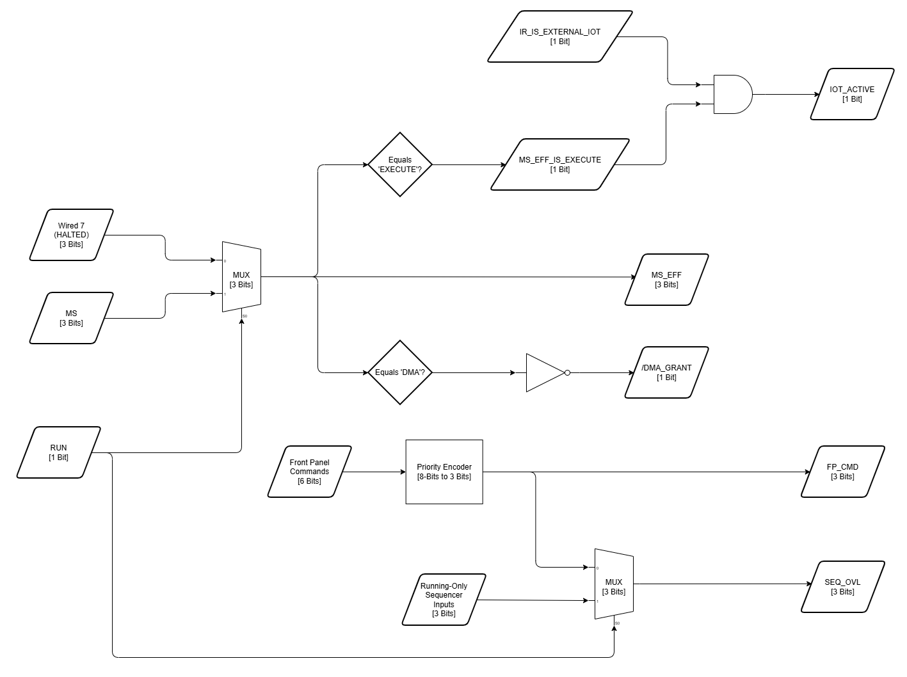
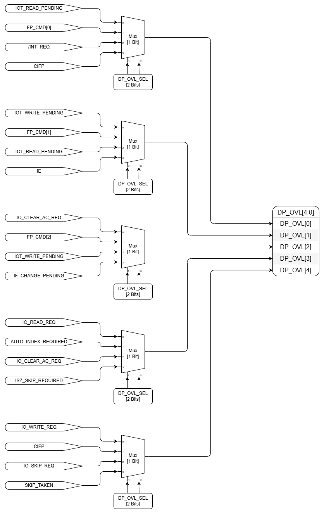

# Control Store Organization

## 1. Purpose

Defines the physical organization of the control store: how the logical control function of [Control Addressing](./02-control-addressing.md) and the logical [Control Word](./04-control-word.md) are realized in memory devices and discrete multiplexers.

This document establishes:

- the device technology and its constraints
- how the control store is divided into independently addressed parts, and the fields each part produces
- the ROM stage that translates the instruction into address information
- the address map of each part, including address bits shared among condition inputs
- how control-word fields are packed into device outputs
- what the ROM-generation tools must verify

The logical control word, the control inputs, and the behavior they select are defined elsewhere and are not changed by this document.

### 1.1 Terms

| Term | Meaning |
|---|---|
| slice | a part of the control store that produces a fixed subset of control-word fields from its own address ([Control Addressing §2.1](./02-control-addressing.md#21-partitioned-and-two-level-control-stores)) |
| sequencer slice | the slice producing `MS_NEXT`, `MS_LOAD`, `RUN_NEXT`, `HLT_REQ_NEXT`, and `/INITIALIZE` (section 4.1) |
| datapath slice | the slice producing every encoded field except the sequencer fields (section 4.2) |
| `MS_EFF` | the effective major state: the 3-bit major-state code presented to the control store, `MS` while running and `HALTED` (code 7) while halted (section 5.1); the `MS` register itself is unchanged |
| `MS_EFF_IS_EXECUTE` | a derived signal: 1 when `MS_EFF` is EXECUTE (code 2), else 0; equivalently, `MS = EXECUTE` and `RUN = 1` (section 5.1) |
| `TS_CODE[1:0]` | the 2-bit binary code of the current TS presented to the control store: TS − 1 (TS1 = 00 … TS4 = 11), taken directly from the TS code register (section 5.1) |
| mapping ROM | ROM devices inside the control store that map IR and TS to the instruction-dependent part of the slice addresses for the following TS of EXECUTE; the mapping stage of [Control Addressing §2.1](./02-control-addressing.md#21-partitioned-and-two-level-control-stores). The name follows the mapping PROMs of microprogrammed machines, which map an instruction to its microprogram |
| `MAPR` | the mapping register: holds the mapping ROM output for the current TS, loaded at each main-sequence TP ([Mapping Register](../01-architecture/01-registers.md#mapr--mapping-register); section 5.4) |
| `VARIANT` | a 5-bit slice address field identifying the instruction-dependent behavior in the current TS: the mapping ROM's variant in EXECUTE, `00·IR_CLASS` otherwise (section 5.4) |
| overlay | an address field that carries different condition inputs in different contexts ([Control Addressing §6.3](./02-control-addressing.md#63-domain-separation)) |
| `DP_OVL[4:0]` | the datapath slice's 5-bit overlay field |
| overlay group | one fixed assignment of condition inputs to `DP_OVL[4:0]` |
| `DP_OVL_SEL` | a 2-bit signal selecting which overlay group drives `DP_OVL[4:0]` (sections 5.4 and 6) |
| `FP_CMD[2:0]` | the encoded front-panel command (section 5.2) |
| `SEQ_OVL[2:0]` | the sequencer slice's 3-bit overlay field: the running-only sequencer inputs while running, `FP_CMD[2:0]` while halted (section 5.6) |
| `IR_SEQ` | the 1-bit sequencer address input carrying the one instruction decode the sequencer slice needs in the current TS (section 5.4) |
| 28C256 | a parallel EEPROM with 15 address bits and 8 data bits (32K × 8) |
| shadow SRAM | an AS7C256C-15 32K × 8 static RAM loaded from a 28C256 at power-on; the control store is read from it (section 8.1) |

Status: the slice structure, device technology, and packing rules are design decisions. The specific address-bit assignments, variant counts, and overlay groups are the packer's current, verified result (section 10).

---

## 2. Design Constraints

| Constraint | Consequence |
|---|---|
| Control logic is discrete: memory devices and standard discrete logic only; no PAL, GAL, CPLD, or FPGA | Every function wider than a few gates is a ROM lookup; glue is limited to multiplexers, encoders, and latches |
| Each control-store device is a 28C256-class EEPROM shadowed by a 32K × 8 SRAM; the slices, the mapping ROM, and the timing ROM are read from the SRAMs (section 8.1) | Each slice address is at most 15 bits; each device supplies 8 control-word bits |
| Device count matters but is not the primary concern | Control-word width, not address depth, sets the device count; width is reduced where it costs no logic |

The control store is sparse: most addresses are unreachable or repeat another address's word. Sparsity is permitted ([Control Addressing §7.2](./02-control-addressing.md#72-sparsity)).

---

## 3. Overview


The diagram shows the address inputs of the two slices. Each input is formed by logic drawn separately: `MS_EFF` and `SEQ_OVL` in section 5, `VARIANT` and `IR_SEQ` in section 5.3, and `DP_OVL` in section 6. The fields each slice produces are listed in section 4.

Signal flow:

- `MS` and `RUN` form `MS_EFF`, and a registered decode of them supplies `MS_EFF_IS_EXECUTE` (section 5.1).
- The front-panel commands are encoded into `FP_CMD[2:0]`.
- The mapping ROM reads `IR` and `TS` and produces the entry for the following TS of EXECUTE. `MAPR` captures it at each main-sequence TP, so during each TS `MAPR` holds the entry for that TS.
- `MS_EFF_IS_EXECUTE` selects, for each of three fields, either the `MAPR` field or a predecode source (section 5.4). Each field is an address input of a different part of the control store:
  - `VARIANT` → datapath slice
  - `IR_SEQ` → sequencer slice
  - `DP_OVL_SEL` → datapath overlay
- The datapath overlay presents the runtime conditions or `FP_CMD` selected by `DP_OVL_SEL` on `DP_OVL[4:0]` (section 6).
- The datapath slice reads `MS_EFF`, `TS`, `VARIANT`, and `DP_OVL[4:0]`.
- The sequencer slice reads `MS_EFF`, `TS`, the sequencer inputs, `SEQ_OVL[2:0]`, `IR_SEQ`, `IR_NO_EXECUTE`, and `IR_OPR_HLT`.

No field of the mapping ROM's output reaches the datapath or the sequencing logic directly; every field is used only to address the slice ROMs or to select the overlay.

Because the mapping ROM is evaluated one TS ahead, only one ROM access lies between a TS boundary and a settled control word (section 5.4.3).

---

## 4. Slices

The control store is partitioned into two slices ([Control Addressing §2.1](./02-control-addressing.md#21-partitioned-and-two-level-control-stores)). Every encoded control-word field is produced by exactly one slice.

### 4.1 Sequencer Slice

Fields:

```
MS_NEXT, MS_LOAD, RUN_NEXT, HLT_REQ_NEXT, /INITIALIZE
```

These fields depend on the same small set of inputs in every major state: run control, halt and front-panel inputs, the interrupt and DMA requests, and the instruction decodes on `IR_SEQ`, A2, and A1. Separating them keeps those inputs out of the datapath slice address.

Width: 7 bits, one device; one output is spare.

### 4.2 Datapath Slice

Fields: every other encoded field of the control word, grouped here by function. Widths are in bits. The fields are defined in [Microarchitectural Control Signals §5](./20-control-output-definitions/01-microarchitectural-control-signals.md#5-signal-definitions), except `/RD`, `/WR`, `/DB_READ`, and `/DB_WRITE`, which are defined in [Architectural Control Signals §4](./20-control-output-definitions/02-architectural-control-signals.md#4-signal-definitions).

| Group | Fields (width) | Bits |
|---|---|---|
| Memory interface | `/RD` (1), `/WR` (1), `AB_SRC` (1), `MFB_SRC` (1), `MDB_SRC` (2), `MA_LOAD` (1), `MA_SRC` (2), `MB_LOAD` (1), `MB_SRC` (2), `EA_ADDR_LOAD` (1), `EA_ADDR_SRC` (1) | 14 |
| Internal data bus | `IDB_DRIVE` (1), `IDB_SRC` (3) | 4 |
| Registers and ALU | `AC_LOAD` (1), `AC_SRC` (3), `L_LOAD` (1), `L_OP` (2), `MQ_LOAD` (1), `MQ_SRC` (1), `ALU_A_SRC` (2), `ALU_B_SRC` (1), `ALU_OP` (2), `IR_LOAD` (1), `PC_LOAD` (1), `PC_INC` (1), `PC_SRC` (2), `SKIP_LOAD` (1) | 20 |
| Fields and interrupts | `IF_LOAD` (1), `IF_SRC` (2), `DF_LOAD` (1), `DF_SRC` (3), `DIF_LOAD` (1), `DIF_SRC` (3), `IB_LOAD` (1), `CIFP_LOAD` (1), `CIFP_VAL` (1), `IE_LOAD` (1), `IE_VAL` (1), `II_LOAD` (1), `II_VAL` (1) | 18 |
| External IOT | `IOT_TRANSFER_LOAD` (1), `IOT_TRANSFER_VAL` (2), `/DB_READ` (1), `/DB_WRITE` (1) | 5 |

The 44 fields total 61 bits; bit sharing packs them into 44 (section 7.2). Control-word fields that are derived or supplied from outside the control store (`/DMA_GRANT`, `IOT_ACTIVE`, `IOA[5:0]`, `IOP[2:0]`, `GTF_FLAGS`, `IF_DF_COMBINED`, `DB_INPUT`, `MDB_INPUT`) are not produced by either slice.

Width: 44 bits after packing (section 7), six devices.

---

## 5. Address Formation



The diagram shows the major-state code and its decodes (section 5.1), the front-panel command code (section 5.2), and the `SEQ_OVL` multiplexer (section 5.6). The mapping stage is drawn in section 5.3.

### 5.1 Major-State and Timing-State Codes

`MS` uses five of its eight codes (`FETCH = 0`, `DEFER = 1`, `EXECUTE = 2`, `INTERRUPT = 3`, `DMA = 4`). The control store sees:

```
MS_EFF = HALTED (7)   if RUN = 0
MS_EFF = MS           otherwise
```

realized by a 3-bit 2:1 multiplexer selected by `RUN`. `HALTED` is the halted pseudo-state; no separate `RUN` address bit is needed.

`MS` itself is not changed while halted, except that START, EXAMINE, and DEPOSIT load FETCH. Otherwise it keeps the held major state, because CONTINUE resumes at TS1 of the held state ([Major State Timing §8.1](../09-timing/03-major-state-timing.md#81-main-timing-while-halted)), and because the DMA arbiter observes `MS` directly. Only the control store sees code 7.

The substitution loses no information the control store needs: while halted, no control word depends on which major state is held, and while running, `MS_EFF = MS`. It replaces a `RUN` address bit that would not fit in the 15-bit datapath slice address.

`MS_EFF_IS_EXECUTE` is registered, so that address formation need not decode MS at the start of each TS:

1. During TP, a gate decodes `MS = EXECUTE AND RUN = 1` from the capture ranks of MS and RUN, which are static then.
2. As TP ends, a flip-flop publishes the result together with MS and RUN. The power-on reset clears it.

This gate is the only logic between a capture rank and an output rank ([Timing Architecture §7.6](../09-timing/02-timing-architecture.md#76-rule-6--two-ranks)).

Two architectural outputs are decoded from `MS_EFF` rather than stored in the control store, so that they stay clean across TS boundaries for a whole major state ([Architectural Control Signals §3.2](./20-control-output-definitions/02-architectural-control-signals.md#32-timing-model)):

```
/DMA_GRANT = NOT (MS_EFF = DMA)
IOT_ACTIVE = MS_EFF_IS_EXECUTE AND IR_IS_EXTERNAL_IOT
```

TS is presented to the control store as `TS_CODE[1:0] = TS − 1`. It is the output of the 2-bit TS code register of the TSEQ logic ([Timing Terminology §5.2](../09-timing/01-terminology.md#52-implementation)), with no logic in between:

| TS | `TS_CODE[1:0]` |
|---|---|
| TS1 | 00 |
| TS2 | 01 |
| TS3 | 10 |
| TS4 | 11 |

While halted, TS is held at TS1, so `TS_CODE = 00`.

### 5.2 Front-Panel Command Code

Console commands are accepted at most one at a time ([External Inputs §4.1](./10-control-input-definitions/04-external-inputs.md#41-console-command-acceptance)). A priority encoder encodes them into `FP_CMD[2:0]`:

| `FP_CMD` | Command |
|---|---|
| 0 | none |
| 1 | `FP_START` |
| 2 | `FP_CONTINUE` |
| 3 | `FP_CLEAR` |
| 4 | `FP_LOAD_ADDRESS` |
| 5 | `FP_EXAMINE` |
| 6 | `FP_DEPOSIT` |

### 5.3 Mapping ROM


The diagram shows the mapping ROM (this section), `MAPR` and its clock (section 5.4.1), and the EXECUTE selection (section 5.4.2). Outside EXECUTE the multiplexers select `00·IR_CLASS`, the wired overlay group, and `IR_INDIRECT`; in EXECUTE they select `MAPR` (section 5.4.2).

The mapping ROM ([Control Addressing §2.1](./02-control-addressing.md#21-partitioned-and-two-level-control-stores)) maps the instruction to the address information each slice needs in EXECUTE. It is evaluated one TS ahead: the entry at TS *n* is the entry for TS *n*+1, and the entry at TS4 is the entry for TS1.

Address:

```
A14..A3 = IR[11:0]
A2..A1  = TS_CODE
A0      = 0 (wired)
```

Output fields, for the EXECUTE TS that follows the addressed TS:

| Field | Width | Meaning |
|---|---|---|
| variant | 5 (D4..D0) | the instruction-dependent behavior that applies in that TS of EXECUTE |
| overlay group | 2 (D6..D5) | the overlay group presented to the datapath slice in that TS (section 6) |
| sequencer decode | 1 (D7) | the instruction decode the sequencer slice needs in that TS |

The mapping ROM is one device. Its output is used only through `MAPR` (section 5.4).

The sequencer decode carries a different decode in different timing states of EXECUTE. Because the mapping ROM is indexed by TS, it outputs whichever decode the sequencer word depends on there:

| EXECUTE TS | Sequencer decode | Use |
|---|---|---|
| 4 | `IR_IS_CAF` | CAF system initialization |
| other | 0 | the sequencer word depends on no instruction decode |

Two IR values share a variant only when they produce the same datapath words for every condition value in that TS. The current specification needs 4, 19, 8, and 7 variants in EXECUTE TS1 to TS4, within the 32 that `VARIANT` allows. A single variant code shared by all four timing states would need far more than 32 values, which is why the mapping ROM is indexed by TS.

The instruction-dependent conditions that select behavior within a case, such as IOT operation bits and memory-extension decodes, are absorbed into the variant. Only runtime conditions reach the address through the overlay.

### 5.4 Mapping Register and EXECUTE Selection

#### 5.4.1 Mapping Register

`MAPR` is an 8-bit register that captures the mapping ROM output at every main-sequence TP (TP1 to TP4). It is defined in [Registers](../01-architecture/01-registers.md#mapr--mapping-register). During TS *n*, `MAPR` holds the mapping ROM entry for EXECUTE TS *n* of the current IR:

| `MAPR` bits | Field |
|---|---|
| `MAPR[4:0]` | variant |
| `MAPR[6:5]` | overlay group |
| `MAPR[7]` | sequencer decode |

`MAPR` does not load at the console timing pulse (TPC).

#### 5.4.2 EXECUTE Selection

The slice and overlay address inputs are formed from `MAPR` in EXECUTE and from predecode or fixed sources otherwise:

| Signal | `MS_EFF_IS_EXECUTE = 1` | `MS_EFF_IS_EXECUTE = 0` |
|---|---|---|
| `VARIANT` | `MAPR[4:0]` | `00·IR_CLASS` |
| `DP_OVL_SEL` | `MAPR[6:5]` | 1 (the state group, section 6.1) |
| `IR_SEQ` | `MAPR[7]` | `IR_INDIRECT` |

`VARIANT` is formed by a 5-bit 2:1 multiplexer; `DP_OVL_SEL` and `IR_SEQ` by three sections of a quad 2:1 multiplexer selected by `MS_EFF_IS_EXECUTE`. Like the `MS_EFF` and `SEQ_OVL` multiplexers, this is address formation: it selects which inputs reach the address and evaluates no condition.

`IR_INDIRECT` is taken from its predecode gates on the live IR ([IR-Derived Fields](./10-control-input-definitions/02-ir-derived-fields.md#ir_indirect)), not from `MAPR`. Outside EXECUTE, `MAPR` holds entries for EXECUTE timing states, which carry no indirect decode; FETCH TS4, where the sequencer selects DEFER or EXECUTE, reads the live IR, valid from FETCH TP2.

`IR_CLASS` is likewise taken from predecode gates on the live IR ([IR-Derived Fields](./10-control-input-definitions/02-ir-derived-fields.md#ir_class)) and is valid from FETCH TP2. It selects the instruction-dependent datapath words of FETCH TS3 and TS4 and of DEFER. In FETCH TS1 and TS2, INTERRUPT, DMA, and while halted, IR holds the previous instruction, or is undefined after power-on, so every datapath word in those contexts must be the same for all values of `IR_CLASS`; the packer verifies this (section 9).

All contexts with `MS_EFF_IS_EXECUTE = 0` (FETCH, DEFER, INTERRUPT, DMA, and halted) therefore share one overlay group, wired as group 1. Its signals must fit `DP_OVL[4:0]`; its low three bits carry different signals while running and while halted (section 6.3).

#### 5.4.3 Correctness and Timing

The lookahead entry is correct whenever it is used:

- IR is loaded only at FETCH TP2 ([Major State Timing §9.1](../09-timing/03-major-state-timing.md#91-defer-follows-an-indirect-mri)).
  - The entry `MAPR` captures at that TP is formed from the previous IR. No TS uses it, because FETCH TS3 is outside EXECUTE.
  - From TP3 on, every entry is the current IR's: the mapping ROM has all of TS3 to settle on the new IR. TS always advances from TS *n* to TS *n*+1, so the entry captured at TP *n*−1 is the entry for the current IR and TS. Every EXECUTE TS1 follows a TP4 whose IR is the instruction's IR, whether it was entered from FETCH, DEFER, or a held state.
- A halt commits only at TP4, and while halted TS is held at TS1 and IR is not loaded ([Major State Timing §8.1](../09-timing/03-major-state-timing.md#81-main-timing-while-halted)). `MAPR` therefore holds the TS1 entry of the held instruction until CONTINUE resumes it. Single Step and Single Instruction halt at TP4, so they are covered by the same rule. `MAPR` must not load at TPC, because the held TS is TS1 and an entry captured there would be the TS2 entry.
- `MAPR`'s power-on value is undefined. It is not used before the first EXECUTE, which always follows a FETCH TP4, because the power-on reset leaves the processor halted in FETCH ([Timing Terminology §3.4](../09-timing/01-terminology.md#34-power-on-reset)).

Timing: the mapping ROM has a whole TS to settle before the TP that loads `MAPR`. Between a TS boundary or a condition change and a settled control word lie the `MS_EFF`, `MS_EFF_IS_EXECUTE`, selection, and overlay logic and one slice-ROM access.

### 5.5 Datapath Slice Address

```
A14..A12 = MS_EFF
A11..A10 = TS_CODE
A9..A5   = VARIANT
A4..A0   = DP_OVL[4:0]
```

### 5.6 Sequencer Slice Address

Address, in every run mode:

```
A14..A12 = MS_EFF
A11..A10 = TS_CODE
A9       = HLT_REQ
A8       = FP_STOP
A7..A5   = SEQ_OVL[2:0]
A4       = /DMA_REQ
A3       = IR_SEQ
A2       = IR_NO_EXECUTE
A1       = IR_OPR_HLT
A0       = 0
```

`IR_NO_EXECUTE` is taken from predecode gates on the live IR ([IR-Derived Fields](./10-control-input-definitions/02-ir-derived-fields.md#ir_no_execute)). It decides only FETCH TS4 and DEFER TS4: with `IR_SEQ = IR_INDIRECT` it tells FETCH TS4 whether the instruction completes there or continues to DEFER, and it tells DEFER TS4 whether the instruction completes there. The sequencer word in every other context must not depend on it.

`IR_OPR_HLT` is likewise taken from predecode gates on the live IR ([IR-Derived Fields](./10-control-input-definitions/02-ir-derived-fields.md#ir_opr_hlt)). It decides only FETCH TS3, where a Group 2 HLT sets `HLT_REQ` ([Sequencing and Internal Control §3.4.4](./30-direct-control-definitions/01-sequencing-and-internal-control.md#344-hlt-instruction-request-capture)); IR holds the current instruction from FETCH TP2. The sequencer word in every other context must not depend on it.

`SEQ_OVL[2:0]` is a 3-bit 2:1 multiplexer selected by `RUN`:

| `RUN` | `SEQ_OVL[2]` | `SEQ_OVL[1]` | `SEQ_OVL[0]` |
|---|---|---|---|
| 0 (halted) | `FP_CMD[2]` | `FP_CMD[1]` | `FP_CMD[0]` |
| 1 (running) | `FP_SINGLE_INSTRUCTION` | `FP_SINGLE_STEP` | `INTERRUPT_REQUEST_VALID` |

While halted, the running-only inputs cannot change the sequencer word and the front-panel command can; while running, the reverse holds.

### 5.7 Front-Panel Command Path

Console commands are executed only while halted ([Major State Timing §8.2](../09-timing/03-major-state-timing.md#82-console-transaction)), and they reach both slices without passing through `MAPR`.

While `RUN = 0`:

- `MS_EFF = HALTED` (7), so `MS_EFF_IS_EXECUTE = 0` and the EXECUTE selection ignores `MAPR` (section 5.4.2): `VARIANT = 00·IR_CLASS`, on which no halted word depends, `DP_OVL_SEL = 1`, and `IR_SEQ = IR_INDIRECT`.
- `DP_OVL_SEL = 1` presents the state group, whose `RUN` multiplexer carries `FP_CMD[2:0]` on `DP_OVL[2:0]` while halted (sections 6.2 and 6.3). The datapath slice address is therefore `MS_EFF = 7`, the held `TS`, `VARIANT = 00·IR_CLASS`, and `DP_OVL = {CIFP, AUTO_INDEX_REQUIRED, FP_CMD}`, which selects the command's datapath word.
- `SEQ_OVL` carries `FP_CMD[2:0]` (section 5.6), which selects the command's sequencer word: `RUN_NEXT` for START and CONTINUE, `MS_NEXT` and `MS_LOAD` for START, EXAMINE, and DEPOSIT, and `/INITIALIZE` for CLEAR.

No overlay selection depends on the command: being halted alone forces the state group. `MAPR` selects among the other groups only in EXECUTE.

A console transaction commits at TPC, and `MAPR` does not load at TPC (section 5.4.1). `MAPR` therefore keeps the entry it held when the processor halted, across any number of console commands. No console command loads IR, so that entry remains correct for CONTINUE (section 5.4.3). START, EXAMINE, and DEPOSIT leave FETCH as the held state, which does not use `MAPR`.

The front-panel inputs used while running (`FP_STOP`, `FP_SINGLE_STEP`, and `FP_SINGLE_INSTRUCTION`) reach only the sequencer slice address, `FP_STOP` directly and the other two through `SEQ_OVL` when `RUN = 1`. They do not pass through `MAPR` or the datapath overlay.

---

## 6. Datapath Overlay



The five overlay bits `DP_OVL[4:0]` are driven by five 4:1 multiplexers, one per bit, all selected by `DP_OVL_SEL[1:0]`. Input *n* of every multiplexer belongs to overlay group *n*, so `DP_OVL_SEL = n` presents group *n* on `DP_OVL[4:0]`. Each group presents the runtime conditions that can change the datapath word in its contexts ([Control Addressing §6.3](./02-control-addressing.md#63-domain-separation)).

### 6.1 Overlay Groups

| Input / `DP_OVL_SEL` | Group | Used in |
|---|---|---|
| 0 | external IOT | external-IOT EXECUTE TS1–TS3; also every EXECUTE variant with no runtime condition |
| 1 | state | `MS_EFF_IS_EXECUTE = 0`: FETCH, DEFER, INTERRUPT, DMA, halted; wired (section 5.4.2); low three bits multiplexed by `RUN` (section 6.3) |
| 2 | external IOT TS4 | external-IOT EXECUTE TS4; SRQ |
| 3 | instruction conditions | SKON, ISZ TS4, JMS TS1 |

### 6.2 Multiplexer Inputs

| Input (group) | `DP_OVL[4]` | `DP_OVL[3]` | `DP_OVL[2]` | `DP_OVL[1]` | `DP_OVL[0]` |
|---|---|---|---|---|---|
| 0 (external IOT) | `IO_WRITE_REQ` | `IO_READ_REQ` | `IO_CLEAR_AC_REQ` | `IOT_WRITE_PENDING` | `IOT_READ_PENDING` |
| 1 (state), `RUN = 0` | `CIFP` | `AUTO_INDEX_REQUIRED` | `FP_CMD[2]` | `FP_CMD[1]` | `FP_CMD[0]` |
| 1 (state), `RUN = 1` | `CIFP` | `AUTO_INDEX_REQUIRED` | `SKIP` | 0 | 0 |
| 2 (external IOT TS4) | `IO_SKIP_REQ` | `IO_CLEAR_AC_REQ` | `IOT_WRITE_PENDING` | `IOT_READ_PENDING` | `/INT_REQ` |
| 3 (instruction conditions) | 0 | `ISZ_SKIP_REQ` | `IF_CHANGE_PENDING` | `IE` | `CIFP` |

`/INT_REQ` enters group 2 qualified by the SRQ decode, and is presented as deasserted (1) to every other instruction. Only SRQ's variant depends on it, and without the qualifier a late change on this slow shared line would disturb the external IOT's TS4 control word.

Sixteen distinct signals drive the 20 inputs: the 13 runtime conditions and the three `FP_CMD` bits. Input 1's low three bits come from the `RUN` multiplexer (section 6.3), which carries `FP_CMD` while halted and `SKIP` and two zeros while running; input 3's `DP_OVL[4]` is wired 0. `CIFP`, `IO_CLEAR_AC_REQ`, `IOT_READ_PENDING`, and `IOT_WRITE_PENDING` each drive two inputs.

The groups and pin assignments are produced by the control-store packer (section 9), which always places the `MS_EFF_IS_EXECUTE = 0` group at input 1. A variant with no runtime condition may use any group, because its datapath words do not depend on `DP_OVL`. Group 2 relies on the TS4 request window ([Major State Timing §5.2.7](../09-timing/03-major-state-timing.md#527-ts4)), which excludes `IO_READ_REQ` and `IO_WRITE_REQ` in TS4.

### 6.3 State-Group Run Multiplexer

The state group's low three bits pass through a 3-bit 2:1 multiplexer selected by `RUN`, exactly as `SEQ_OVL` does (section 5.6):

| `RUN` | `DP_OVL[2]` | `DP_OVL[1]` | `DP_OVL[0]` |
|---|---|---|---|
| 0 (halted) | `FP_CMD[2]` | `FP_CMD[1]` | `FP_CMD[0]` |
| 1 (running) | `SKIP` | 0 | 0 |

`FP_CMD` selects a datapath word only while halted, and `SKIP` only in FETCH TS4 of a Group 2 OPR, so neither loses a context it needs. `CIFP` and `AUTO_INDEX_REQUIRED` reach `DP_OVL[4:3]` in both modes. Like the other address multiplexers, this is address formation: it selects which inputs reach the address and evaluates no condition.

---

## 7. Control-Word Packing

### 7.1 Hardwired Constants

Constant and instruction-field sources are hardwired in the datapath rather than supplied by value fields: `IF_SRC = 0` (zero), `MA_SRC = 2` (zero), `PC_SRC = 1` (0001), `DF_SRC = 0` (zero), `DF_SRC = 4` (`IR[5:3]`), `DIF_SRC = 1` (zero), and `DIF_SRC = 4` (`IR[5:3]`). A control-store ROM cannot output a value it does not receive on its address, so no control-word field carries an input's value. See [Microarchitectural Control Signals](./20-control-output-definitions/01-microarchitectural-control-signals.md).

### 7.2 Physical Bit Sharing

Fields that never require a value in the same control word share device outputs ([Control Word §5.6](./04-control-word.md#56-physical-bit-sharing)). The current packing:

| Bits | Fields |
|---|---|
| 3 | `AC_SRC`, `DF_SRC`, `MA_SRC` |
| 3 | `DIF_SRC`, `ALU_A_SRC` |
| 2 | `ALU_OP`, `IF_SRC` |
| 2 | `IOT_TRANSFER_VAL`, `L_OP`, `MB_SRC`, `PC_SRC` |
| 1 | `AB_SRC`, `IE_VAL` |
| 1 | `ALU_B_SRC`, `CIFP_VAL` |
| 32 | the remaining 29 fields, unshared: `IDB_SRC` (3 bits), `MDB_SRC` (2 bits), and 27 one-bit fields |

Total: 44 bits in six devices, four bits spare.

Fields that share bits are aligned at the low-order end of the shared bits: a field of width *w* occupies the lowest *w* of them. A field narrower than its shared bits, such as `MA_SRC` in the three bits it shares with `AC_SRC` and `DF_SRC`, does not use the highest one.

A field shares bits only through wiring. No decoder or gate follows the control store ([Control Addressing §2](./02-control-addressing.md#2-control-address-definition)).

---

## 8. Device Summary

| Function | Devices |
|---|---|
| Mapping ROM | 1 × 28C256 + 1 × AS7C256C shadow SRAM |
| Datapath slice | 6 × 28C256 + 6 × AS7C256C |
| Sequencer slice | 1 × 28C256 + 1 × AS7C256C |
| Timing ROM ([Timing Terminology §3.5](../09-timing/01-terminology.md#35-timing-rom)) | 1 × 28C256 + 1 × AS7C256C |
| Shadow copy (section 8.1) | 15-bit copy counter; tri-state address buffers for each SRAM; `LOADING` flip-flop and write-strobe logic |
| `MS_EFF` select | 3-bit 2:1 multiplexer |
| `SEQ_OVL` select | 3-bit 2:1 multiplexer |
| State-group `RUN` select (section 6.3) | 3-bit 2:1 multiplexer |
| `MS_EFF_IS_EXECUTE` | one gate and one flip-flop, between the ranks of MS and RUN |
| `/INT_REQ` overlay qualifier | one gate with the SRQ decode (section 6.2) |
| `TS_CODE` | none: the TS code register belongs to the timing generator |
| `/DMA_GRANT`, `IOT_ACTIVE` | comparator for the DMA code; one AND gate |
| `MAPR` | 8-bit register |
| EXECUTE selection | a 5-bit 2:1 multiplexer for `VARIANT`; three sections of a quad 2:1 multiplexer for `DP_OVL_SEL` and `IR_SEQ` |
| `FP_CMD` | 8-to-3 priority encoder |
| Datapath overlay | five 4:1 multiplexers |

Total: 9 EEPROMs and 9 shadow SRAMs, plus the copy logic, register, multiplexers, gates, comparators, and encoder. The `IR_INDIRECT`, `IR_CLASS`, `IR_NO_EXECUTE`, and `IR_OPR_HLT` predecode gates belong to predecode, and the `INSTR_END` gates to the DMA interface ([Architectural Control Signals §4.10](./20-control-output-definitions/02-architectural-control-signals.md#410-instruction-end-instr_end)), not to the control store.

### 8.1 Shadow Copy

The control store and the timing ROM run from fast SRAMs. Each SRAM is loaded from its EEPROM during the power-on reset ([Timing Terminology §3.4](../09-timing/01-terminology.md#34-power-on-reset)):

- A 15-bit copy counter drives every SRAM's address through tri-state buffers, which are disabled after the copy so that the address formation drives the address. Each EEPROM, addressed by the same counter, drives its SRAM's data pins. All nine devices copy in parallel, about 7 ms in all.
- The copy runs only during the power-on reset, from the supply supervisor. It never runs at `/INITIALIZE`: CAF and front-panel CLEAR assert `/INITIALIZE` while the machine is running from the SRAMs.
- Only the `LOADING` flip-flop and the copy write strobe reach an SRAM's `/WE`, which has a pull-up. No control-word field and no bus reaches it, and the control store is not in the memory address space.
- While `LOADING` is set, TSEQ is held, `CW_VALID` is deasserted, and `/INITIALIZE` is asserted, so no control word from a partly loaded SRAM acts. The reset ends after the copy, and the CLEAR transaction that follows reads the loaded SRAMs.
- Each EEPROM's `/WE` is tied high, so it cannot be written in circuit.

In normal running each SRAM has `/CE` and `/OE` asserted and `/WE` deasserted, so its address access time (15 ns) applies; the address buffer adds 9 ns ([option2/timing.md](../../option2/timing.md) §2, §3).

DEC precedent: the KL10 processor loaded its microcode into control RAM from its front-end PDP-11 at power-up. The PDP-8/E's control is hardwired and has no control store.

---

## 9. Verification

The control-store packer (`tools/rom-generation/control-store-packer`) produces every device image from the maintained specifications and verifies that, for every reachable input state:

- the mapping ROM, overlays, and slices together select the symbolic control word of the applicable execution case
- every field whose Value Required When condition holds has its required value after bit sharing is undone
- no address bit carries an input that the address map does not assign to it in that context

It also verifies that the derivation of `INSTR_END` ([Architectural Control Signals §4.10](./20-control-output-definitions/02-architectural-control-signals.md#410-instruction-end-instr_end)) holds exactly in the TS4 contexts whose sequencer word completes an instruction.

Reachability is defined by the input constraints, IR derivations, timing constraints, and state invariants already used by the symbolic generator and the equivalence analyzer.

The packer forms each address as the hardware does: in EXECUTE TS *n*, `MAPR` holds the mapping ROM image entry at TS *n*−1 (TS4 for TS1) and supplies `VARIANT`, `DP_OVL_SEL`, and `IR_SEQ`; outside EXECUTE, `VARIANT` is `00·IR_CLASS`, `DP_OVL_SEL` is 1, `IR_SEQ` is `IR_INDIRECT`, and A2 is `IR_NO_EXECUTE`; the overlay groups supply `DP_OVL`; `SEQ_OVL` follows `RUN`. It then reads the slice images and compares every field whose condition holds.

---

## 10. Open Items

- **Timing:** one slice-ROM access plus the address-formation and overlay logic make up `T_CS`, which must fit within the TS evaluation window ([Timing Architecture §11](../09-timing/02-timing-architecture.md#11-control-word-settling)); the mapping ROM is off this path (section 5.4.3). The control word passes through no pipeline register; immediate-effect signals are windowed by `CW_VALID`. The TSTEP counts per TS are set in [Timing Architecture §5.1](../09-timing/02-timing-architecture.md#51-structure), from the critical paths, within the limits of [Timing Architecture §11.4](../09-timing/02-timing-architecture.md#114-timing-budget).
- **Datapath diagrams:** datapath diagrams that show a control-supplied input on the IF, MA, or PC source multiplexers must show the hardwired constants instead.
- **Group assignments:** the overlay groups, pin assignments, variant counts, and bit sharing in sections 5 to 7 are the packer's current result. They change when the specifications do; the packer reports them on every run.
