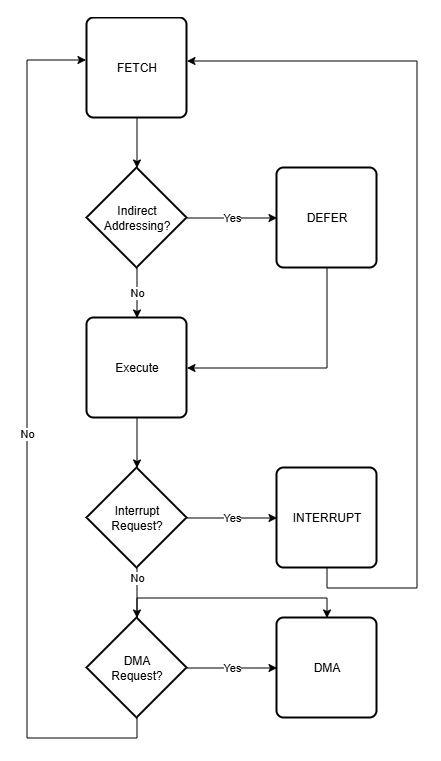

# Sequencing Control Signals

## 1. Purpose

Defines control outputs responsible for **control flow within the CPU**.

These signals determine:

- Major State progression
- Run/stop behavior

Sequencing signals:

- originate from the control word
- operate only on control flow
- do not influence timing generation (TS/TP)
- do not perform datapath operations

Related:
- [Control Model](../01-control-model.md)
- [Control Constraints](../03-control-constraints.md)
- [Timing Model](../../09-timing/README.md)

---

## 2. Scope

Sequencing control signals define **how control transitions between Major States (MS)**.

They select:

- MS_NEXT
- RUN_NEXT
- HLT_REQ_NEXT

They do NOT:

- advance Timing State (TS)
- control TP generation
- move data
- update registers

---

## 3. Global Properties

### 3.1 Functional Model

Control is defined as:

```
CONTROL = f(MS, TS, IR_FIELDS, FLAGS, EXT)
```

Sequencing signals are part of this function.

- TS and TP are inputs
- sequencing produces next-state decisions
- state updates occur only at TP

---

### 3.2 Determinism

For every tuple:

```
(MS, TS, IR_FIELDS, FLAGS, EXT)
```

there must be exactly one:

```
MS_NEXT value
RUN_NEXT value
HLT_REQ_NEXT value
```

No ambiguity is permitted.

---

### 3.3 Timing Independence

Sequencing signals:

- do not control TS progression
- do not interact with the shift register
- do not depend on timing generation mechanisms

TS/TP behavior is defined in:

- [Timing Model](../../09-timing/README.md)

---

## 4. Signal Definitions

---

### 4.1 Next Major State (MS_NEXT)

**Name**  
MS_NEXT  

**Type**  
Encoded field  

**Domain**  
Sequencing  

**Width** 3 bits

Defined in:
- [Major State Model](../../03-microarchitecture/00-state-model.md)

**Description**

Specifies the next Major State.

**Value Encoding:**
```text
0 → FETCH
1 → DEFER
2 → EXECUTE
3 → INTERRUPT
4 → DMA
```

**Behavior**

- evaluated during TS4
- committed at TP4
- becomes the new MS

**Constraints**

- must be defined for all states at TS4
- must not change outside TS4
- must not be modified by μops

---

### 4.2 Run State Next Value (RUN_NEXT)

**Name** RUN_NEXT  
**Type** Single-bit state-output field  
**Domain** Sequencing  
**Width** 1 bit  

**Description**  
Specifies the next value of the RUN state.

**Behavior**
- evaluated as part of the control word
- committed at TP
- becomes the new RUN state after the update point

**Value Encoding:**
```text
0 → processor halted
1 → processor running
```

**Constraints**
- must be defined in every control word
- must not be computed outside the control store
- must not be modified by μops
- must be consumed as a committed state value through [RUN](../10-control-input-definitions/01-flags.md#run)

**Used for**
- front-panel START behavior
- front-panel CONTINUE behavior
- Single Step halt behavior
- Single Instruction halt behavior
- halt-request consumption behavior

---

### 4.3 Halt Request Next Value (HLT_REQ_NEXT)

**Name** HLT_REQ_NEXT  
**Type** Single-bit state-output field  
**Domain** Sequencing  
**Width** 1 bit  

**Description**  
Specifies the next value of the halt-request pending state.

**Behavior**
- evaluated as part of the control word
- committed at TP
- becomes the new HLT_REQ state after the update point

**Value Encoding:**
```text
0 → no halt request pending
1 → halt request pending
```

**Constraints**
- must be defined in every control word
- must not be computed outside the control store
- must not be modified by μops
- must be consumed as a committed state value through [HLT_REQ](../10-control-input-definitions/01-flags.md#hlt_req)

**Used for**
- front-panel STOP behavior
- HLT instruction behavior from [IR_OPR_HLT](../10-control-input-definitions/02-ir-derived-fields.md#ir_opr_hlt)
- halt-request preservation
- halt-request clearing after consumption

---

## 5. Sequencing Model

---

### 5.1 Timing State Interpretation

Timing State (TS):

- is derived from a one-hot shift register
- is not controlled by sequencing logic
- is treated as an input to control

Defined in:
- [Timing Model](../../09-timing/README.md)

Control:

- reacts to TS
- does not alter TS progression

---

### 5.2 Major State Transition

At TS4:

- MS_NEXT is selected
- transition occurs at TP4

General transitions:

- FETCH → EXECUTE or DEFER
- DEFER → EXECUTE
- EXECUTE → FETCH, INTERRUPT, or DMA
- INTERRUPT → FETCH
- DMA → FETCH or DMA

All transitions must be explicitly defined.



---

### 5.3 TS Coverage Requirement

Control must define behavior for every:

```
(MS, TS, IR_FIELDS class)
```

Implications:

- no TS may be left undefined
- unused TS must produce safe control outputs
- all control outputs must be valid

---

## 6. Skip and Flow Behavior

Skip behavior is implemented through datapath control outputs.

Conditional evaluation occurs through CTRL_ADDR selection.

The selected CONTROL_WORD determines whether PC_INC is asserted.

Sequencing signals:
- do not directly modify PC
- do not directly implement skip behavior

Defined in:
- [Group 2 Execution](../../03-microarchitecture/07-opr/02-group2-execution.md)

---

## 7. Interaction Rules

---

### 7.1 No Implicit Control Flow

All control flow must be:

- explicitly encoded
- fully determined by control inputs

No implicit transitions are permitted.

---

### 7.2 Single Effective Decision

At each TS:

- only one sequencing decision may be effective

This ensures deterministic behavior.

---

### 7.3 External Input Usage

External signals (EXT):

- may influence sequencing via conditions
- must not directly change MS or TS

---

### 7.4 Separation from Timing Extensions

Sequencing signals must not interact with:

- clock gating
- shift register control
- external bus ownership mechanisms

Those are defined in:
- [Timing Model](../../09-timing/README.md)

---

## 8. Summary

Sequencing control signals define **how control progresses between Major States**.

They select:

- MS_NEXT
- RUN_NEXT
- HLT_REQ_NEXT

They do not:

- control timing (TS/TP)
- execute datapath operations
- move or transform data

All sequencing behavior is:

- explicit
- deterministic
- fully defined per TS

See:

- [Control Model](../01-control-model.md)
- [Control Constraints](../03-control-constraints.md)
- [Micro-Operations](../../03-microarchitecture/02-micro-operations.md)