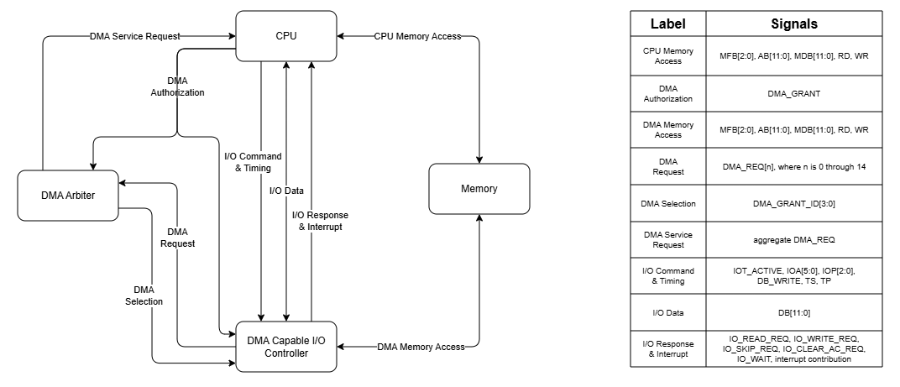

# I/O Architecture

## 1. Purpose

This document defines the architectural participants, interfaces, and boundaries of the I/O subsystem.

---

## 2. Architectural Participants

The I/O subsystem includes:

- CPU
- external I/O controllers
- DMA-capable controllers
- DMA arbiter
- memory subsystem

---

## 3. External IOT Interface

External IOT execution uses:

- `IOT_ACTIVE`
- `IOA[5:0]`
- `IOP[2:0]`
- `DB[11:0]`
- `IO_READ_REQ`
- `IO_WRITE_REQ`
- `IO_SKIP_REQ`
- `IO_CLEAR_AC_REQ`
- `/IO_WAIT`
- shared TS and TP timing signals

---

## 4. I/O Subsystem Context

The following diagram shows the major I/O subsystem participants and the logical interfaces between them.

The diagram distinguishes:

- programmed-I/O communication between CPU control and an external controller
- DMA requester selection performed by the DMA arbiter
- normal CPU memory access
- DMA memory access performed by the selected controller

The diagram is an architectural overview. The detailed behavioral, timing, ownership, and signal-polarity rules in the applicable interface documents remain authoritative.

---

## 5. Device Addressing

`IOA[5:0]` is the six-bit architectural device address.

Properties:

- Each external controller has one active configured address for each device interface it implements.
- Address assignment is independent of physical backplane position.
- A controller compatible with a DEC device defaults to the corresponding DEC device address when one is defined.
- A compatible controller may be configured to use another nonreserved address.
- A custom controller may use an arbitrary nonreserved address.
- The address configuration mechanism belongs to the physical implementation.
- Two installed controllers must not use the same active address.

A nondefault address may require corresponding software or handler changes. Address configurability does not alter the required operation semantics of a controller claiming compatibility with a DEC device.

---

## 6. I/O Operation Field

`IOP[2:0]` carries `IR[2:0]` unchanged during an external IOT.

Properties:

- IOP is distinct from IOA.
- IOP semantics belong to the selected controller.
- A DEC-compatible controller reproduces the operation encoding and combined-operation behavior of the emulated controller.
- A custom controller may interpret IOP as independent function bits, an encoded operation, or a documented mixture.
- The conventional status, state-change, and transfer pattern is guidance rather than a system-wide requirement.

---

## 7. External IOT Validity

`IOT_ACTIVE` identifies execution of an external IOT.

Controllers must interpret IOA, IOP, controller response signals, and IOT timing behavior only while `IOT_ACTIVE` is asserted.

IOA and IOP are not required to be cleared outside an external IOT.

---

## 8. CPU-Visible Controller Responses

The selected controller may request the following CPU-visible actions:

- `IO_READ_REQ`: device-to-CPU DB transfer
- `IO_WRITE_REQ`: CPU-to-device DB transfer
- `IO_SKIP_REQ`: increment PC
- `IO_CLEAR_AC_REQ`: clear AC

Controller-local state changes do not require a separate CPU response signal. They are defined by the controller and committed at the assigned TP.

---

## 9. Initialization Interface
  
/INITIALIZE is the active-low system-wide reset signal distributed by the CPU to every I/O controller.

Properties:
- /INITIALIZE is independent of external-IOT selection.
- A controller must respond to /INITIALIZE regardless of IOT_ACTIVE, IOA, IOP, interrupt state, or DMA state.
- When /INITIALIZE is asserted, it overrides all controller commands, transfers, flag updates, interrupt requests, DMA activity, and other controller-local actions sampled during the same TSTEP.
- Each controller enters its documented initialized state at the TP ending the asserted TSTEP.
- Each controller must define the exact state of its registers, flags, interrupt-enable state, active operations, bus outputs, /INT_REQ output, and /DMA_REQ output after initialization.
- A controller must terminate any active operation when /INITIALIZE is asserted.
- A controller must release all bus-driving outputs as part of initialization.

The authoritative signal definition is provided by [System Initialization](../04-control/20-control-output-definitions/02-architectural-control-signals.md#49-system-initialization-initialize)

---

## 10. DMA Boundary

DMA arbitration is external to CPU control.

DMA-capable controllers provide individual `/DMA_REQ[n]` request lines to the DMA-request aggregation logic.

The DMA arbiter:

- selects the active DMA controller
- produces `DMA_GRANT_ID[3:0]`
- establishes the combinational `DMA_ENABLE` qualification output
- maintains burst-selection, burst-count, and fairness state

Separate combinational aggregation logic continuously derives aggregate `/DMA_REQ` from `DMA_ENABLE` and the individual controller request lines, as defined in [DMA Arbitration](./06-dma-arbitration.md).

CPU control observes only aggregate `/DMA_REQ`. It does not identify or select an individual DMA controller.

During DMA, the granted controller directly participates in the memory interface and supplies the operation-specific memory-facing signals defined in [DMA Interface](./05-dma-interface.md).

---

## 11. Related Documents

- [External IOT Interface](./02-external-iot-interface.md)
- [I/O Timing](./03-io-timing.md)
- [Controller Contract](./04-controller-contract.md)
- [DMA Interface](./05-dma-interface.md)
- [DMA Arbitration](./06-dma-arbitration.md)
