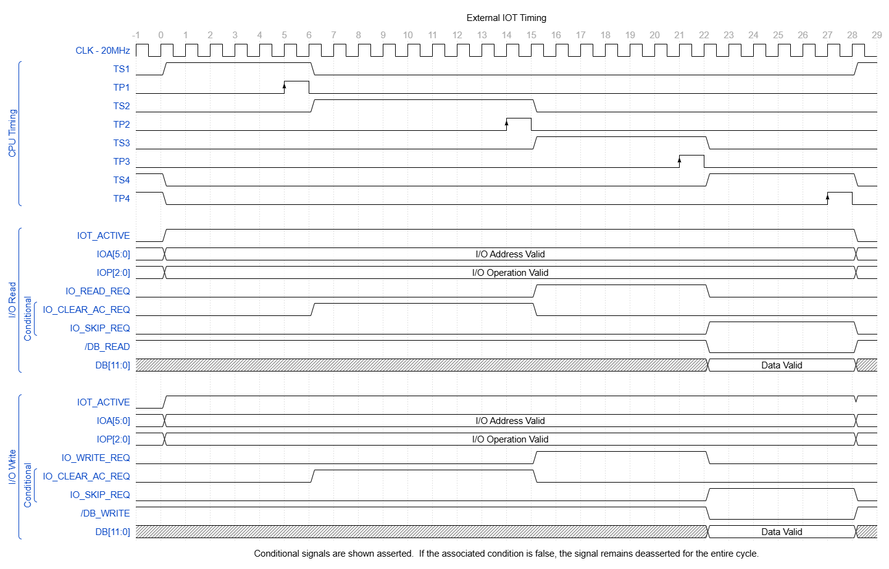
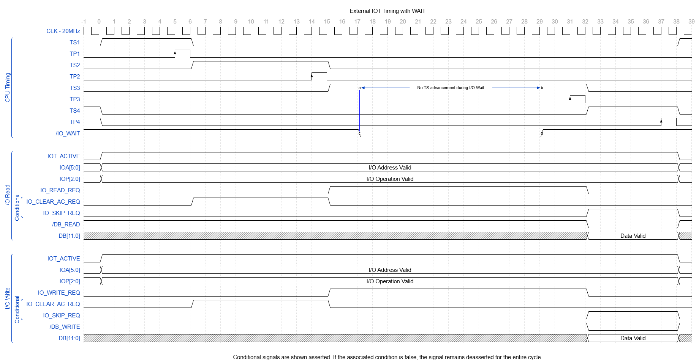

# I/O Timing

## 1. Purpose

This document defines external-IOT phase usage, TP commit rules, controller timing participation, and I/O wait behavior.

---

## 2. Shared Timing Interface

TS and TP signals are exposed to external controllers through the I/O interface.

Controllers use the shared TP events directly. Dedicated I/O commit strobes are not defined.

All controller-local state changes caused by an IOT occur only at TP events.

---

## 3. IOT Phase Allocation

### 3.1 External-IOT Timing Overview

The following diagram shows representative external-IOT read and write timing without an asserted wait request.

The diagram shows the following sequence:

- `IOT_ACTIVE`, `IOA`, and `IOP` remain valid throughout the external-IOT EXECUTE major state.
- A selected controller presents `IO_READ_REQ` or `IO_WRITE_REQ` during TS3.
- CPU control accepts the request at TP3.
- CPU control asserts `/DB_READ` or `/DB_WRITE` during TS4.
- DB remains valid through TP4.
- The requested data transfer commits at TP4.
- The diagram shows a representative `IO_CLEAR_AC_REQ` asserted during TS2 and committed at TP2.
- Controller-specific operations may instead assert `IO_CLEAR_AC_REQ` during TS3 or TS4, provided AC clear does not commit at the same TP as a pending read transfer.
- `IO_SKIP_REQ`, when its condition is true, is asserted during TS4 and commits at TP4.

Conditional signals are shown asserted. When the corresponding condition is false, the signal remains deasserted for the complete cycle.

The waveform is representative. Device-specific controller documents define which response signals are required by each IOT.

### 3.2 TS1: Selection and Decode

During TS1:

- `IOT_ACTIVE` is asserted
- IOA is valid
- IOP is valid
- controllers evaluate address match
- the selected controller decodes IOP
- no controller action commits at TP1

TS1 is the I/O selection and operation-decode phase.

### 3.3 TS2 through TS4: Execution

The selected controller may request actions during TS2 through TS4, subject to the constraints in [External IOT Interface](./02-external-iot-interface.md).

Direct response timing:

- `IO_CLEAR_AC_REQ` asserted during a TS requests AC clear at the following TP.
- `IO_SKIP_REQ` is valid only during TS4 and requests PC increment at TP4.

DB transfer request timing:

- `IO_READ_REQ` or `IO_WRITE_REQ` asserted during a TS is accepted by CPU control at the following TP.
- CPU control asserts `/DB_READ` or `/DB_WRITE` during the next TS.
- The corresponding DB transfer commits at the following TP.
- A DB transfer request must occur early enough for its transfer phase and commit TP to remain within the current external-IOT EXECUTE major state.

For the standard external-IOT read and write timing:

- the selected controller asserts `IO_READ_REQ` or `IO_WRITE_REQ` during TS3
- CPU control accepts the request at TP3
- CPU control asserts `/DB_READ` or `/DB_WRITE` during TS4
- the DB transfer commits at TP4

---

## 4. TP4 Sequencing Boundary

Device actions may commit at TP4 while CPU sequencing and interrupt decisions also commit at TP4.

Constraints:

- TP4 sequencing and interrupt decisions must depend only on state and inputs available at completion of TP3.
- A controller result committed at TP4 cannot affect the sequencing or interrupt decision committed at TP4.
- A controller may assert `/INT_REQ` during TS4 when the assertion depends only on registered controller state available before TP4.
- DB ownership must end before ownership changes for the following major state.

---

## 5. I/O Wait

`/IO_WAIT` extends an IOT setup interval for a slower selected controller.

Properties:

- `/IO_WAIT` is distinct from RUN.
- MCLK continues while `/IO_WAIT` is asserted.
- TCLK continues while `/IO_WAIT` is asserted.
- `/IO_WAIT` may inhibit TSTEP advancement only at non-TP setup TSTEPs.
- `/IO_WAIT` is ignored when the current TSTEP is a TP position.
- A TP cannot be extended, repeated, or suppressed by `/IO_WAIT`.
- The selected controller is contractually responsible for qualifying `/IO_WAIT` with `IOT_ACTIVE` and address match.

---

## 6. TSTEP Progression Requirement

TSTEP transition logic must:

- evaluate the pre-edge TSTEP value
- use mutually exclusive transition branches
- perform at most one TSTEP increment per TCLK rising edge
- hold the current non-TP TSTEP while `/IO_WAIT` is asserted
- advance normally when `/IO_WAIT` is deasserted
- advance through a TP position independently of `/IO_WAIT`

---

## 7. Stability During Wait

While a non-TP TSTEP is held by `/IO_WAIT`, all signals required for the pending operation must remain stable, including:

- `IOT_ACTIVE`
- IOA
- IOP
- applicable controller response intent
- DB ownership and source selection when already active
- controller data required by the pending operation

---

## 8. External-IOT Timing with Wait

The following diagram shows `/IO_WAIT` holding an eligible non-TP setup step.

While `/IO_WAIT` is asserted:

- the current eligible setup TSTEP remains active
- no TS or TP advancement occurs
- MCLK and TCLK continue
- `IOT_ACTIVE`, `IOA`, and `IOP` remain stable
- the controller response request remains stable
- data and ownership signals required by the pending operation remain stable

After `/IO_WAIT` is deasserted, normal TSTEP progression resumes. The pending TP occurs exactly once. `/IO_WAIT` does not extend, suppress, or repeat a TP.

The diagram shows a hold during TS3. The same rule applies to any setup TSTEP that the timing contract identifies as eligible for `/IO_WAIT`.

---

## 9. Phase-Specific Response Signals

The following signals apply only to one assigned TS:

- `IO_READ_REQ`
- `IO_WRITE_REQ`
- `IO_CLEAR_AC_REQ`
- `IO_SKIP_REQ`

Rules:

- A phase-specific response is asserted only during its assigned TS.
- The response must be stable before the TP at which CPU control accepts it.
- The response must remain stable through that TP.
- The response is released after the required hold interval.
- A response asserted during one TS does not remain effective during a later TS.
- A controller must assert the response again if another action is required during a later phase.
- A response must be derived from stable registered controller state, IOT selection, IOP decode, and the current TS.
- `IO_READ_REQ` and `IO_WRITE_REQ` request a DB transfer during the following TS and TP.
- `IO_CLEAR_AC_REQ` requests AC clear at the immediately following TP.
- `IO_SKIP_REQ` is valid only during TS4 and requests PC increment at TP4.

---

## 10. Setup-Hold Request

`/IO_WAIT` is a setup-hold request.

Rules:

- `/IO_WAIT` is valid only while the controller is selected during an external IOT.
- `/IO_WAIT` may hold only an eligible non-TP setup TSTEP.
- `/IO_WAIT` remains asserted until the controller can satisfy the setup requirements for the pending TP.
- `/IO_WAIT` is ignored at a TP position.
- `/IO_WAIT` does not itself commit an operation or change controller state.
- Deasserting `/IO_WAIT` permits normal TSTEP progression to resume.

---

## 11. Persistent Service Requests

The following signals represent persistent requests rather than phase-specific actions:

- controller interrupt contribution
- `/DMA_REQ[n]`
- aggregate `/INT_REQ`

Rules:

- A persistent request remains asserted while its underlying request condition remains true.
- A persistent request is not consumed merely because it is sampled.
- The owning controller or arbiter deasserts the request only when the condition is cleared, serviced, completed, canceled, or otherwise removed by its contract.
- Persistent requests may span multiple TS, TP, and major-state boundaries.
- Aggregate `/INT_REQ` remains asserted while at least one controller interrupt contribution remains asserted.
- Aggregate `/DMA_REQ` is qualified by the combinational arbiter output `DMA_ENABLE`.
- Aggregate `/DMA_REQ` may be deasserted while one or more controller `/DMA_REQ[n]` lines remain asserted.
- Separate combinational aggregation logic continuously derives aggregate `/DMA_REQ` from `DMA_ENABLE` and `/DMA_REQ[14:0]`, as defined in [DMA Arbitration](./06-dma-arbitration.md).

---

## 12. Grant Signals

The DMA authorization and selection interface consists of:

- /DMA_GRANT
- DMA_GRANT_ID[3:0]

/DMA_GRANT is produced by CPU control and indicates that the CPU has released the memory interface during MS = DMA.  
DMA_GRANT_ID is produced by the DMA arbiter and identifies the selected DMA priority channel.

Rules:

- DMA_GRANT_ID values 0 through 14 identify valid configured DMA priority channels.
- DMA_GRANT_ID value 15 indicates that no controller is selected.
- The arbiter must drive DMA_GRANT_ID to 15 whenever no valid controller selection exists.
- DMA_GRANT_ID must identify a valid selected controller before that controller drives any DMA-owned interface.
- DMA_GRANT_ID remains stable for the complete active controller selection.
- Grant identity must not change during a bounded burst.
- A controller may act only when /DMA_GRANT is asserted and DMA_GRANT_ID matches its configured DMA priority.
- No controller may act while DMA_GRANT_ID is 15.
- Grant withdrawal follows the ownership-release ordering defined in [DMA Arbitration](./06-dma-arbitration.md).

---

## 13. Data and Address Signals

Controller-driven DB, MFB, AB, and MDB values are transfer-specific signals.

Rules:

- A controller-driven value must be valid before the TP that samples it.
- The value must remain stable through the sampling TP.
- The controller must maintain the value for the required hold interval after the TP.
- The controller must release the applicable bus before ownership transfers to another participant.
- MFB and AB must remain stable for the complete asserted /RD or /WR interval.

---

## 14. Synchronization Boundary

The physical implementation must synchronize `/IO_WAIT` before it influences TSTEP progression. The controller contract must prevent asynchronous state changes or repeated commit events.

---

## 15. Related Documents

- [Timing Architecture](../09-timing/02-timing-architecture.md)
- [External IOT Interface](./02-external-iot-interface.md)
- [Controller Contract](./04-controller-contract.md)
