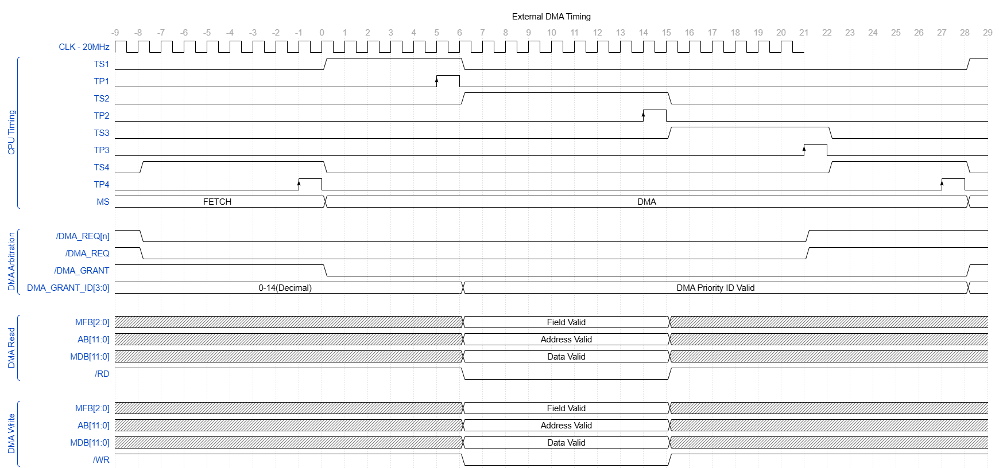

# DMA Interface

## 1. Purpose

This document defines DMA ownership, memory-interface participation, transfer direction, and per-word timing.

---

## 2. Architectural Model

DMA uses single-cycle transfer semantics.

The granted controller maintains:

- complete-operation memory field
- complete-operation memory address
- address progression
- remaining operation word count
- transfer direction
- controller-specific completion state

Each `MS = DMA` cycle transfers at most one memory word.

---

## 3. DMA-Owned Interfaces

During a granted DMA operation, the controller supplies:

- `MFB[2:0]`
- `AB[11:0]`
- `/RD` or `/WR`
- `MDB[11:0]` during a write

During a DMA read, memory supplies MDB.

The CPU does not drive MFB, AB, MDB, /RD, or /WR during DMA ownership.

---

## 4. Addressing

MFB and AB are treated as one DMA-selected memory address interface.

The granted controller supplies both values. MFB and AB must remain stable throughout the active /RD or /WR window.

---

## 5. Direction

The granted controller asserts exactly one of /RD or /WR for a valid transfer.

### 5.1 DMA Read

During a DMA read:

- controller drives MFB and AB
- controller asserts /RD
- controller deasserts /WR
- memory drives MDB
- controller captures MDB at TP2

### 5.2 DMA Write

During a DMA write:

- controller drives MFB and AB
- controller asserts /WR
- controller deasserts /RD
- controller drives MDB
- memory stores MDB at TP2

---

## 6. DMA Timing

### 6.1 DMA Timing Overview

The following diagram shows one single-word DMA major-state cycle and the preceding transition from FETCH.



The diagram shows the following sequence:

- A controller asserts its configured `/DMA_REQ[n]` only after preparing the complete next transfer.
- The DMA arbiter establishes `DMA_ENABLE`.
- Separate combinational aggregation logic continuously derives aggregate `/DMA_REQ` from `DMA_ENABLE` and `/DMA_REQ[14:0]`.
- CPU control enters `MS = DMA` and asserts `/DMA_GRANT`.
- The arbiter commits the selected `DMA_GRANT_ID` at TP1.
- The selected controller presents one complete memory operation during TS2.
- Exactly one word transfers at TP2.
- The controller transfer state and arbiter burst count update at TP3.
- During TS4, aggregate `/DMA_REQ` determines whether CPU control remains in DMA or returns to FETCH at TP4.
- `/DMA_GRANT` remains asserted throughout `MS = DMA` and deasserts when CPU control exits DMA.
- `DMA_GRANT_ID` returns to octal `17` when no controller is selected.

The DMA-read and DMA-write groups are alternative views of the same transfer phase. They do not occur simultaneously.

No DMA wait state exists. A controller that cannot complete the next transfer keeps its `/DMA_REQ[n]` line deasserted until the complete transfer is prepared.

### 6.2 TS1 and TP1: Arbitration or Selection Continuation

If no controller is selected:

- the DMA arbiter evaluates pending requests during TS1
- it selects a winner
- the selected DMA_GRANT_ID commits at TP1

A requesting controller is contractually ready to complete its next DMA word transfer.  
Selection at TP1 therefore commits the controller to completing exactly one transfer at TP2.

If a controller remains selected for the current burst, TS1 preserves that selection and prepares the next transfer.  
No memory transfer commits at TP1.

### 6.3 TS2 and TP2: Memory Transfer

During TS2, the selected controller presents one complete memory operation.

At TP2:

- exactly one DMA word transfer commits
- for a read, the controller captures MDB
- for a write, memory captures MDB

A valid controller selection must not reach TP2 without completing one DMA word transfer.

### 6.4 TS3 and TP3: Count Update

At TP3:

- the controller updates its complete-operation address and remaining word count
- the DMA arbiter increments the active burst count

These updates correspond to the word transferred at TP2.  
TP3 does not represent an independent transfer or permit accounting for a transfer that did not commit at TP2.

### 6.5 TS4 and TP4: Continuation Decision

During TS4:

- controllers establish their `/DMA_REQ[n]` outputs
- the arbiter establishes `DMA_ENABLE`
- combinational aggregation logic continuously derives aggregate `/DMA_REQ`
- `/DMA_REQ[n]`, `DMA_ENABLE`, and aggregate `/DMA_REQ` settle before TP4

At TP4, CPU control samples aggregate `/DMA_REQ` and commits:

```text
/DMA_REQ = 0 -> MS_NEXT = DMA
/DMA_REQ = 1 -> MS_NEXT = FETCH
```

The selected controller and arbiter prepare all selection-release and ownership-release decisions before TP4.

A controller may release early only after completing the current TP2 transfer.  
If the controller cannot immediately complete another transfer, it must deassert its request before another selection is made.

---

## 7. DMA Wait Policy

No DMA wait signal is defined.  
A controller must prepare the complete next DMA word transfer before asserting /DMA_REQ[n].  
Once selected at TP1, the controller must complete exactly one DMA word transfer at TP2.  
A slow controller remains unrequested until its next transfer is ready.  
After completing a transfer, a controller that cannot immediately complete another transfer must deassert /DMA_REQ[n] and request service again when the next transfer is prepared.  
A controller must not extend, suppress, repeat, or delay a DMA TP.

---

## 8. Related Documents

- [Memory Interface](../06-memory/02-memory-interface.md)
- [DMA and Console Memory Access](../06-memory/06-dma-and-console-access.md)
- [DMA Arbitration](./06-dma-arbitration.md)
- [Invalid Conditions](./07-invalid-conditions.md)
