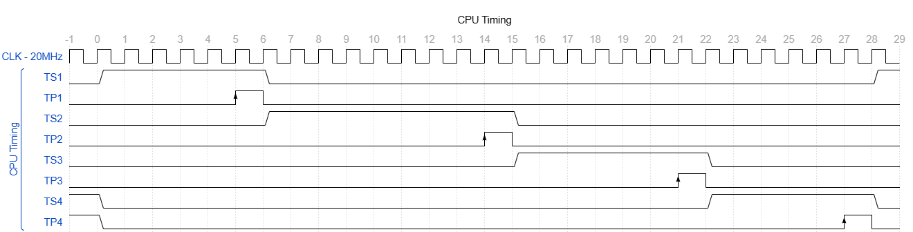

# Timing Architecture

## 1. Purpose

This document defines the structure and rules of the timing system.

It describes:
- how time is represented
- how events are scheduled
- how execution is sequenced

---

## 2. CPU Timing Overview

The CPU timing model is illustrated in the following diagram:

This diagram represents the canonical timing structure:
- Timing States (TS) define phase windows
- Timing Pulses (TP) define execution events
- All actions occur at TP events

---

## 3. Timing Model Overview

The system uses a layered timing model:

TCLK → TSTEP → TP → TS  

with a separate control layer:

MS (Major State)

### 3.1 Signal Polarity Convention

TP and TS signals are active-high.

- TP signals are positive pulses.
- TS signals are positive phase windows.
- A TS signal is asserted high while its corresponding phase is active.
- A TP signal is asserted high for its corresponding commit event.

The timing diagrams show the actual electrical levels of both signal classes.

---

## 4. Timing Sequence

### 4.1 Timing Progression

On each rising edge of TCLK:

- TSTEP advances to the next position unless a defined timing rule holds an eligible setup position.
- Exactly one TSTEP remains active.
- A TP position cannot be held by `/IO_WAIT`.

---

### 4.2 Timing Pulses

Each TSTEP generates a corresponding TP:

TPn = active when TSTEPn is active

TP is:
- one timing step wide
- aligned to the rising edge of TCLK
- the only event trigger in the system

---

## 5. Timing States

### 5.1 Structure

Timing States are defined as ranges of timing steps:

TS1 = TSTEP range  
TS2 = TSTEP range  
TS3 = TSTEP range  
TS4 = TSTEP range  

TS ranges are based on DEC timing reference diagrams. TS2 is intentionally the long cycle to accommodate memory access timing, following DEC's slow-cycle design. Short-cycle support is planned for a future implementation phase.

See: [cpu-timing-overview](../../diagrams/timing/cpu-timing/export/cpu-timing-overview.png)

---

### 5.2 Function

TS provides:

- setup intervals
- stable conditions
- enabled datapaths

TS signals represent **phase windows**, not events.

Transitions of TS do not cause state changes.

---

## 6. Event Semantics

### 6.1 Core Rule

TS defines when an operation is allowed  
TP defines when the operation occurs  

---

### 6.2 Execution Pattern

TSn:
  data stabilizes

TPn:
  data is latched (state change occurs)

TS(n+1):
  results are used

---

### 6.3 Diagram Interpretation

As shown in the CPU timing overview diagram:

- TS signals are represented as level signals (windows)
- TP signals are represented as event markers (arrows)
- Only TP markers indicate execution events
- TS edges represent phase transitions only and have no event semantics

---

## 7. State Change Rules

### 7.1 Rule 1 — Event-Driven Updates

All state changes occur on TP events.

---

### 7.2 Rule 2 — Setup Before Event

All inputs must be stable before TP.

---

### 7.3 Rule 3 — Phase Transition

TS transitions occur after TP on the next clock edge.

---

### 7.4 Rule 4 — No Level-Driven Behavior

No state changes occur directly from TS levels.

---

### 7.5 Rule 5 — No Falling Edge Dependence

Only the TP rising edge is significant.

---

## 8. Major State Integration

### 8.1 Role of MS

MS defines:
- operation type
- control flow

---

### 8.2 Relationship

MS operates over one or more TS/TP cycles:

MS → TS → TP

---

### 8.3 Transitions

Major State changes occur at defined TP events.

---

## 9. Fast vs Slow Timing

### 9.1 Mechanism

Timing speed is controlled by modifying TSTEP progression.

- Slow: all steps executed
- Fast: some steps skipped

The fast/slow mechanism will be modeled after DEC's timing design. The specific implementation (which steps are eligible for skipping, control mechanism, static vs dynamic selection) is not yet defined.

---

### 9.2 Effect

- TS duration changes as a result of TSTEP changes
- TP count per cycle changes
- MS behavior remains unchanged

---

### 9.3 I/O Wait Integration

During external-IOT EXECUTE, the selected controller may assert `/IO_WAIT` to extend an eligible non-TP setup interval.

Properties:

- MCLK continues.
- TCLK continues.
- TSTEP remains at the current eligible setup position.
- TS remains in the current phase.
- No state change occurs while the non-TP setup position is held.
- When `/IO_WAIT` is deasserted, TSTEP progression resumes normally.
- `/IO_WAIT` is ignored at TP positions.
- A TP position advances normally and generates exactly one TP event.

Constraints:

- `/IO_WAIT` does not modify RUN.
- `/IO_WAIT` does not alter MS.
- `/IO_WAIT` does not directly modify architectural state.
- `/IO_WAIT` must be synchronized before influencing TSTEP progression.
- All pending-operation inputs must remain stable while waiting.
- TSTEP transition logic must evaluate the pre-edge TSTEP value.
- At most one TSTEP increment may occur on a TCLK rising edge.
- Fast timing must not skip a TSTEP currently held by `/IO_WAIT`.

Detailed controller behavior is defined in [I/O Timing](../07-io/03-io-timing.md)

---

## 10. DMA Integration

DMA does not inhibit timing progression.
DMA is a control-selected Major State (MS = DMA), sequenced identically to other major states.

Properties:
- TSTEP progression is unaffected by DMA
- TS and TP proceed normally during MS = DMA
- DMA entry and exit are selected through MS_NEXT at TP4

Constraint:
- Timing must not freeze, gate, or skip TSTEP progression for DMA.
- No DMA_HOLD or shift-enable inhibit mechanism exists.

DMA sequencing and datapath behavior are defined in:
- [Sequencing Control Signals](../04-control/20-control-output-definitions/03-sequencing-control-signals.md)
- [Datapath Mapping](../04-control/05-datapath-mapping.md)

---

## 11. Summary

The system timing model enforces:

- deterministic execution
- discrete event-driven state changes
- clear separation between:
  - timing (TS, TP)
  - control (MS)

